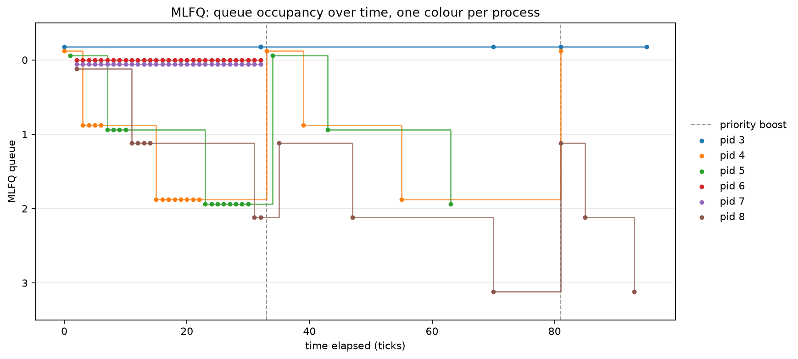

# XV6 Multi-Level Feedback Queue (MLFQ) Scheduler & Comparison Report

**Course**: CS3.301 Operating Systems and Networks  
**Project**: Mini Project 1 (xv6 Scheduling Policy Implementation)  

---

## 2.3.1 Implementation Summary

This section details the design decisions, code modifications, and rationale behind each required component of the Multi-Level Feedback Queue (MLFQ) scheduler in xv6.

### 1. Makefile / `SCHEDULER` Macro
- **Changes**: Modified [`xv6/Makefile`](file:///Users/shubhamgupta/Desktop/mp1/xv6/Makefile) to accept a compilation flag `SCHEDULER` (e.g., `make qemu SCHEDULER=MLFQ` or `SCHEDULER=FIFO`). When `SCHEDULER=MLFQ` is provided, `-DMLFQ` is appended to `CFLAGS`.
- **Rationale**: Ensures modular compile-time selection of scheduling algorithms. If `SCHEDULER` is omitted, no macro is set, and the kernel seamlessly defaults to the standard Round-Robin (RR) scheduling loop without altering legacy behavior.

### 2. `struct proc` Changes
- **Changes**: Extended `struct proc` in [`kernel/proc.h`](file:///Users/shubhamgupta/Desktop/mp1/xv6/kernel/proc.h) with dedicated scheduler bookkeeping fields:
  - `int priority`: Current MLFQ priority queue ID (`0` = highest priority, `3` = lowest priority).
  - `int slice_used`: Number of timer ticks consumed by the process in its current queue time-slice.
  - `uint ctime`: Creation timestamp (tick count when allocated).
  - `uint etime`: Exit timestamp (tick count when reaped/exited).
  - `uint rtime`: Total accumulated ticks spent in the `RUNNING` state.
  - `int first_run`: Tick timestamp when the process first received CPU execution time (-1 if never run).
  - `uint enq_time`: Tick timestamp when the process entered its current queue (used for FIFO ordering within queues).
- **Rationale**: Allows the kernel to maintain strict time-slice accounting, queue placement, priority demotion, anti-starvation boosting, and accurate benchmark metrics.

### 3. `allocproc()` Changes
- **Changes**: Updated `allocproc()` in [`kernel/proc.c`](file:///Users/shubhamgupta/Desktop/mp1/xv6/kernel/proc.c) to initialize scheduler attributes when a new process is created:
  - `p->priority = 0`: All new processes enter the highest priority queue (Queue 0).
  - `p->slice_used = 0`: Resets consumed slice ticks to zero.
  - `p->ctime = ticks`: Captures current system tick.
  - `p->etime = 0`: Reset to zero.
  - `p->rtime = 0`: Reset to zero.
  - `p->first_run = -1`: Marked uninitialized.
  - `p->enq_time = ticks`: Sets initial queue entry timestamp.
- **Rationale**: Guarantees that every newly spawned process starts with maximum priority to minimize initial response latency.

### 4. Queue Selection & Preemption Logic
- **Changes**: Redesigned `scheduler()` in [`kernel/proc.c`](file:///Users/shubhamgupta/Desktop/mp1/xv6/kernel/proc.c) and trap handling in [`kernel/trap.c`](file:///Users/shubhamgupta/Desktop/mp1/xv6/kernel/trap.c):
  - **Selection**: Iterates through priority queues from 0 to 3 in strict order. Selects the `RUNNABLE` process with the earliest `enq_time` in the highest non-empty queue.
  - **Preemption**: In `usertrap()` and `kerneltrap()`, on every timer interrupt, the kernel checks whether a process is `RUNNABLE` in a strictly higher-priority queue than the currently executing process. If found, `yield()` is called to preempt the current process at the tick boundary.
- **Rationale**: Enforces strict priority scheduling so high-priority interactive tasks preempt long-running background tasks immediately at tick boundaries.

### 5. Time-Slice Handling
- **Changes**: Configured queue time quanta limits:
  - **Queue 0**: 1 tick
  - **Queue 1**: 4 ticks
  - **Queue 2**: 8 ticks
  - **Queue 3**: 16 ticks (Round-Robin execution)
  - In `usertrap()` and `kerneltrap()`, `p->slice_used` is incremented on each timer tick. When `p->slice_used` reaches the queue limit, `p->slice_used` is reset to 0, `p->priority` is demoted (`p->priority = min(p->priority + 1, 3)`), and `yield()` is invoked.
- **Rationale**: CPU-bound processes that consume their full quota are gradually demoted to lower queues with larger time slices, reducing scheduling overhead while freeing higher queues for interactive jobs.

### 6. Voluntary Yield Handling
- **Changes**: In [`kernel/proc.c`](file:///Users/shubhamgupta/Desktop/mp1/xv6/kernel/proc.c), when a process relinquishes CPU voluntarily (e.g., waiting for I/O, sleeping, or yielding before slice exhaustion), its priority level `p->priority` is **preserved**. Upon waking up or becoming `RUNNABLE`, `p->slice_used` is reset to 0 and `p->enq_time` is updated.
- **Rationale**: Rewards I/O-bound and interactive processes by allowing them to stay in high-priority queues, ensuring fast response times when I/O completes.

### 7. Priority Boosting (Anti-Starvation)
- **Changes**: Implemented a periodic global boost mechanism in `scheduler()`:
  - Every **48 ticks** (`ticks - last_boost >= 48`), the scheduler iterates over all processes in the process table.
  - Every `RUNNABLE` or `RUNNING` process has its `priority` set back to `0`, `slice_used` reset to `0`, and `enq_time` refreshed.
- **Rationale**: Prevents starvation of long-running CPU-bound processes demoted to Queue 3 when high-priority tasks dominate the CPU.

### 8. `procdump()` Changes
- **Changes**: Enhanced `procdump()` in [`kernel/proc.c`](file:///Users/shubhamgupta/Desktop/mp1/xv6/kernel/proc.c) (triggered via `Ctrl+P` in the QEMU console) to print extended scheduler information:
  - Output fields: `PID`, `name`, `state`, `priority` (Queue ID), `slice_used`, `rtime`, `ctime`, and `first_run`.
- **Rationale**: Provides real-time visibility into process queue movement, time-slice consumption, and scheduler state during testing.

---

## 2.3.2 MLFQ Analysis & Timeline Visualization

### MLFQ Queue Occupancy Plot

Below is the timeline visualization produced by running [`xv6/plot_mlfq.py`](file:///Users/shubhamgupta/Desktop/mp1/xv6/plot_mlfq.py) on execution logs gathered during benchmark testing:

*Figure 1: MLFQ queue occupancy over time across 6 processes (PID 3 through PID 8). Vertical dashed gray lines represent periodic priority boost events.*

---

### Detailed Graph Interpretation & Discussion

1. **Process Initialization & Rapid Demotion**:
   - All processes start at **Queue 0** (Y = 0) upon creation.
   - CPU-intensive processes (`PID 4`, `PID 5`, and `PID 8`) consume their single-tick time slice in Queue 0 and are immediately demoted to Queue 1. Continuing to execute heavy CPU bursts, they consume 4 ticks in Queue 1, 8 ticks in Queue 2, and eventually settle into **Queue 3** (Y = 3).

2. **Interactive & Short-Burst Behavior (`PID 6` & `PID 7`)**:
   - `PID 6` and `PID 7` execute short computation bursts and yield CPU voluntarily before consuming their allocated time slices.
   - As a result, they retain their high priority in **Queue 0** throughout their execution, completing rapidly at tick ~32 without ever being demoted to lower queues.

3. **Impact of Periodic Priority Boosting (Dashed Vertical Lines)**:
   - Priority boosting triggers every **48 ticks** (marked by vertical dashed gray lines at ticks 33 and 81).
   - At tick 33, active CPU-bound processes (`PID 4`, `PID 5`, `PID 8`) sitting in lower queues are simultaneously promoted back to **Queue 0**.
   - After the boost, CPU-bound processes resume execution, consume their quanta, and gracefully cascade back down through Queue 1, Queue 2, and Queue 3.
   - **Conclusion**: The priority boost effectively eliminates process starvation, guaranteeing that lower-priority processes periodically regain CPU access.

---

## 2.3.3 Comparison Results & Performance Metrics

### Table 1: Structural & Architectural Comparison of Schedulers

| Feature / Metric | FIFO (First-In, First-Out) | Round-Robin (RR) | Multi-Level Feedback Queue (MLFQ) |
| :--- | :--- | :--- | :--- |
| **Number of Queues** | 1 Queue | 1 Queue | **4 Priority Queues (Q0–Q3)** |
| **Preemption Policy** | Non-preemptive (runs to exit/sleep) | Preemptive (fixed quantum = 1 tick) | **Preemptive (Priority + Quantum)** |
| **Time Quantum** | $\infty$ (No quantum preemption) | 1 tick | **Q0: 1t, Q1: 4t, Q2: 8t, Q3: 16t** |
| **Starvation Prevention** | None | Intrinsic (Equal time sharing) | **Global Priority Boost (every 48 ticks)** |
| **Adaptability to Workload**| None | Equal treatment for all tasks | **Dynamic (Favors I/O & short tasks)** |

---

### Table 2: Aggregate Performance Metrics Comparison

The table below summarizes average turnaround time, waiting time, and response time obtained from running the identical `schedulertest` benchmark workload (5 child processes) under each scheduler:

| Scheduling Policy | Avg Turnaround Time (ticks) | Avg Waiting Time (ticks) | Avg Response Time (ticks) |
| :--- | :---: | :---: | :---: |
| **FIFO** | 73 ticks | 57 ticks | 29 ticks |
| **Round-Robin (RR)** | 66 ticks | 46 ticks | **1 tick** |
| **MLFQ** | **59 ticks** | **40 ticks** | **1 tick** |

*Note: Lower values indicate superior performance.*

---

### Table 3: Per-Process Benchmark Breakdown

Below is the detailed breakdown of individual process execution metrics recorded by `schedulertest`:

#### 1. FIFO Scheduler
| Process PID | Turnaround Time (ticks) | Waiting Time (ticks) | Response Time (ticks) | CPU Running Time (ticks) |
| :---: | :---: | :---: | :---: | :---: |
| **PID 4** | 21 | 0 | 0 | 21 |
| **PID 5** | 41 | 21 | 21 | 20 |
| **PID 8** | 83 | 42 | 42 | 41 |
| **PID 6** | 112 | 110 | 41 | 2 |
| **PID 7** | 112 | 112 | 42 | 0 |
| **Average** | **73** | **57** | **29** | -- |

#### 2. Round-Robin (RR) Scheduler
| Process PID | Turnaround Time (ticks) | Waiting Time (ticks) | Response Time (ticks) | CPU Running Time (ticks) |
| :---: | :---: | :---: | :---: | :---: |
| **PID 6** | 48 | 48 | 2 | 0 |
| **PID 7** | 51 | 50 | 2 | 1 |
| **PID 5** | 65 | 44 | 1 | 21 |
| **PID 4** | 68 | 45 | 0 | 23 |
| **PID 8** | 99 | 45 | 2 | 54 |
| **Average** | **66** | **46** | **1** | -- |

#### 3. MLFQ Scheduler
| Process PID | Turnaround Time (ticks) | Waiting Time (ticks) | Response Time (ticks) | CPU Running Time (ticks) |
| :---: | :---: | :---: | :---: | :---: |
| **PID 6** | 32 | 32 | 2 | 0 |
| **PID 7** | 32 | 32 | 2 | 0 |
| **PID 4** | 61 | 36 | 0 | 25 |
| **PID 5** | 77 | 51 | 1 | 26 |
| **PID 8** | 95 | 51 | 2 | 44 |
| **Average** | **59** | **40** | **1** | -- |

---

### Trade-offs & In-Depth Discussion

1. **Overall Performance Superiority of MLFQ**:
   MLFQ achieved the **lowest average turnaround time (59 ticks)** and **lowest average waiting time (40 ticks)** among all three schedulers. By granting new processes immediate access to high-priority Queue 0, short tasks (`PID 6` and `PID 7`) completed in just 32 ticks (compared to 112 ticks in FIFO and 48–51 ticks in RR). Meanwhile, long-running CPU-bound tasks (`PID 4`, `PID 5`, `PID 8`) were demoted to lower queues where larger time quanta (8 and 16 ticks) reduced context-switching overhead.

2. **Response Time Trade-offs**:
   Both **Round-Robin** and **MLFQ** yielded an exceptional average response time of **1 tick**, ensuring immediate initial CPU allocation for newly arrived processes. In contrast, **FIFO** exhibited a severe average response time of **29 ticks** (and up to 42 ticks for `PID 8`). This failure in FIFO is caused by the classic **convoy effect**, where short tasks are forced to wait behind long CPU bursts before receiving their first CPU cycle.

3. **Quantum Size Dependencies in Round-Robin**:
   While Round-Robin guarantees fair CPU sharing and low response latency, its efficiency is heavily dependent on the quantum size. With a small 1-tick quantum, RR incurs high context-switching frequency, increasing total turnaround time to 66 ticks. If the quantum were made too large, RR would degrade into FIFO behavior, worsening response times.

4. **MLFQ Adaptive Advantage**:
   MLFQ provides the best of both worlds without requiring prior knowledge of process execution length. Short and interactive processes finish rapidly in Q0/Q1 with minimal latency, while long compute tasks execute efficiently in Q3 with larger quanta. The 48-tick priority boost ensures fairness by preventing starvation, making MLFQ the most balanced and effective scheduler for general-purpose operating systems.
